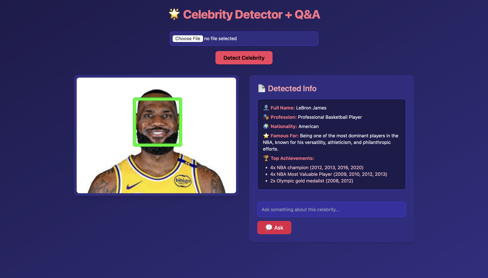

# AI-Powered Celebrity Chatbot
The application takes in an image of a celebrity of your choice, recognizes it and outputs some key details about the celebrity. Further more, application has a simple chat interface which allows user to ask questions about the celebrity and receive relevant response.

## Pipeline
1. The application makes use of the Opencv face detection algorithm to detect just the celebrity face in the uploaded image.
2. The result is then sent to a pre-trained model (Llama4-maverick) to identify the celebrity.
3. Information such as Name, Profession, Acheivements are further extracted.
4. The name entity is used to answer any relevant questions asked by user using an LLM (Llama4-maverick).

## Personal Objective
The project objective is to work on end-to-end machine learning pipeline (MLOps). It is a part of my learning to deploy ML solutions on cloud with CI/CD capabilities. Also, get hands-on experience on some of the key tools such as:
1. Docker
2. Kubernetes
3. Google Cloud
4. CircleCI