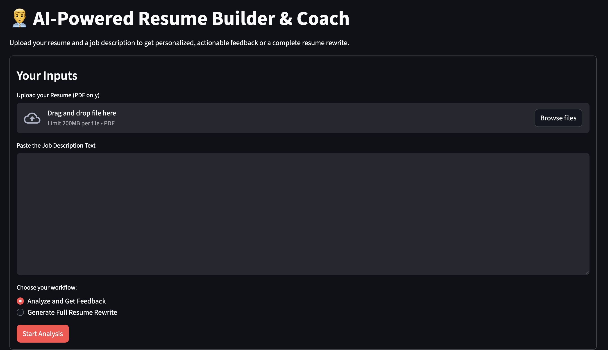

# AI-Powered Resume Builder & Coach
This project was a personal challenge to build an end-to-end RAG workflow that replicates the sophisticated resume analysis and rewriting capabilities seen in leading AI models like Gemini, GPT, and Claude. While the application is fully functional and provides significant value, it serves as a robust foundation. This journey has been an invaluable learning experience, demonstrating how to integrate various techniques from in-memory processing to hybrid retrieval and structured output validation to create a complex, real-world AI application.

## Project Objective
The AI-Powered Resume Builder & Coach is an intelligent application designed to help job seekers optimize their resumes for specific job descriptions. By leveraging a RAG based pipeline with LLMs, the application provides two primary workflows:

1. **Resume Analysis & Feedback:** Analyzes the candidate's resume against a job description, providing a match score, professional summary, missing skills, and rewritten bullet points to improve alignment.

2. **Full Resume Rewrite (beta):** A one-click solution that completely rewrites the candidate's resume, tailoring the content to a specific job description to maximize impact.

## Demo
<video controls src="media/recording.mov" title="Running Example"></video>

## Evolution of the Application

The application's architecture has evolved significantly to become more robust and intelligent. It began with a simple idea and was improved with intentional architectural decisions to address real-world challenges:

1. **From Simple Similarity to RAG:** The initial approach was a basic keyword search. This evolved into a sophisticated RAG pipeline that uses semantic search to understand the meaning of text, providing more accurate and contextual results.
2. **From Semantic Search to Hybrid Retrieval:** Found that relying solely on semantic search could miss important keywords. The current pipeline uses a hybrid approach by combining BM25 (keyword search) with vector search to get the best of both worlds, ensuring high-quality context for the LLM.
3. **From Temporary Files to In-Memory Processing:** Early versions of the application wrote files to disk. This was replaced with in-memory data processing, which is more secure, faster, and basically avoids file system clutter because everytime a tempfile was create, stored and processed, seperate function to remove them iteratively was unnecessary work.
4. **From Arbitrary to Dynamic Chunking:** Instead of breaking the document into chunks of a fixed size, the application now performs an initial LLM call to identify document headers, allowing for intelligent and semantically meaningful chunking with rich metadata. Then applies Recursive Splitting to split the text further.
5. **Enhanced Reliability:** Added Pydantic validation to ensure the LLM's output is always in the correct format, preventing application crashes. Also implemented a centralized error-handling system that provides clear, user-facing error messages instead of failing silently.
6. **Expanded Functionality:** The final major evolution was the addition of a dual workflow system that allows the user to choose between getting detailed feedback and a complete, professionally rewritten resume, all within the same application.

## Architecture Workflow

The application's architecture is designed for efficiency and user experience.

1. **User Interface (UI):** The entire application is built on Streamlit, providing an interactive UI for users to upload files and input text. The UI also manages the user's choice between the two primary workflows. Due to my limited knowledge of building UI, took majority help from LLMs to help me with a simple yet functional UI.

2. **In-Memory Data Ingestion:** Upon form submission, the uploaded PDF is immediately loaded into memory as a BytesIO object. This is a crucial design choice that avoids the performance and security risks of writing temporary files to disk.

3. **Dynamic Document Processing:** The rag_pipeline.py module handles all document-level processing. It uses pdfplumber to extract raw text and then dynamically identifies and extracts headers (e.g., "Experience," "Skills"). This allows the application to split the document into semantically meaningful chunks with metadata, which is essential for accurate RAG.

4. **Dual Workflow Logic:** Based on the user's selection, the app.py script executes one of two distinct workflows:

    1. **Analyze & Feedback:** Parses the resume and job description into structured Pydantic models, then sends this data to the LLM to generate targeted feedback. This workflow also enables a live chat, where RAG retrieves context from the resume and JD to answer user questions.

    2. **Full Rewrite:** Parses the resume data but then sends a different prompt to the LLM, instructing it to act as a resume writer and rewrite the entire document from scratch, leveraging the parsed data and the raw job description text.

5. **LLM Interaction:** The processing.py module acts as the central hub for all LLM interactions. It is responsible for formatting the prompts, making API calls to the LLM, and using PydanticOutputParser to enforce a strict JSON schema for the LLM's output.

6. **Fail-Safe Error Handling:** A centralized error-handling strategy is implemented using st.session_state. If any part of the pipeline (e.g., parsing, LLM call) fails, an error message is explicitly returned and stored in the session state. This halts the application and displays a clear error message to the user, preventing a confusing, non-responsive UI.

## Component Rationale

1. **PDF Reader:** Provides a robust way to handle PDF files efficiently. Numerous options are available like PDFLoader, pdfplumber, PyPDF and so on. The sole purpose is to read the provided PDF file in-memory and provide suitable output for the RAG pipeline for further processing.

2. **LangChain:** Provides a high-level framework for building RAG pipelines, including tools like TextSplitter (Markdown and Recusive) and PromptTemplate, which significantly simplify complex document processing tasks.

3. **Pydantic:** Used to enforce a rigid, machine-readable output format from the LLM. This structured output is the foundation for all subsequent analysis, ensuring that the data is always clean and predictable.

4. **Streamlit:** Chosen for easy UI build (I do not come from app development so needed an easy-to-use python package for quick prototyping and visualizing the results). It allowed data to persist across reruns and enabled the implementation of a robust, session-based error-handling mechanism which made it a compelling choice. Gradio is another viable alternative.

5. **Loggers:** It ensures that every function explicitly communicates both its successful result and any potential error, preventing silent failures and improving functionality.

6. **LLMs:** Used Mistral and DeepSeek models for the entire pipeline since they were free-to-use AI models. Made use of the OpenRouter's APIs to use the models and switched whenever necessary. Also, used HuggingFace embedding models for semantic search.

7. **Prompts:** Specialized prompts for each of the process within the pipeline to make the entire system follow the provided guidelines/guardrails so that the model does not hallucinate and provide false results. By doing so, it also provides better context to the model which improves the generation and reliability.